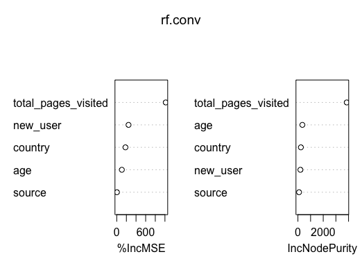
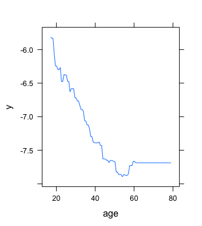
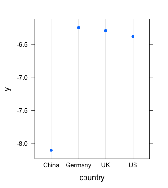
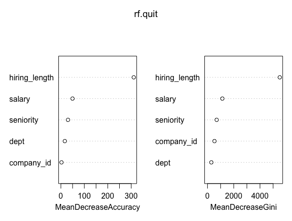
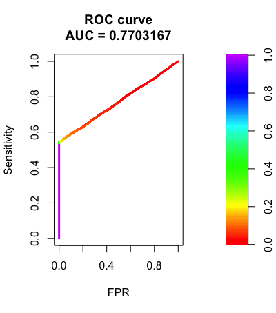
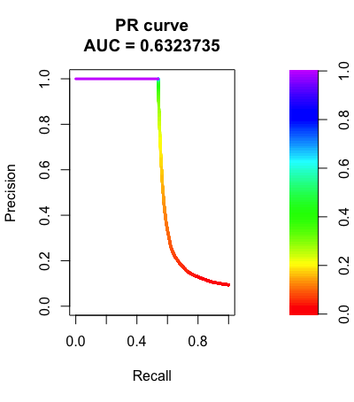
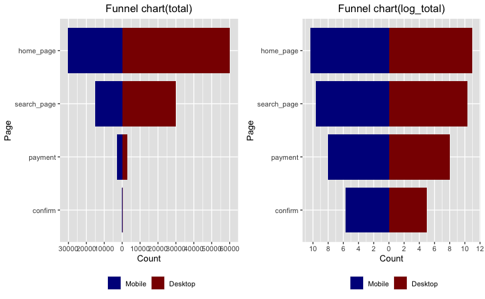
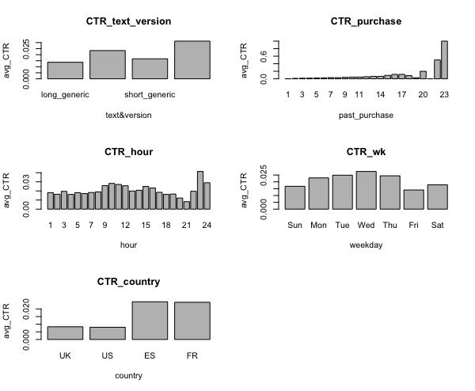
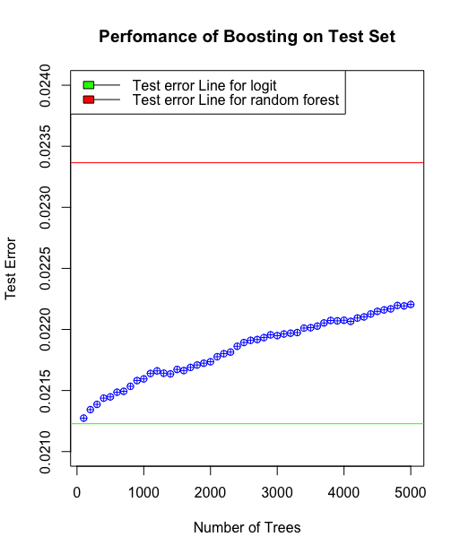
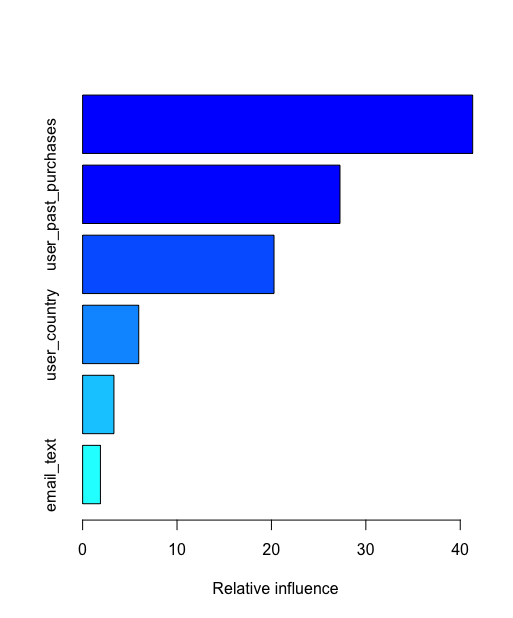

# Data-Challenge-Portfolio
Data challenge projects using R

# [Project 1: Conversion Rate](https://github.com/zhanghanduo337/Conversion-Rate)

## Challenge Description
We have data about users who hit our site: whether they converted or not as well as some of their characteristics such as their country, the marketing channel, their age, whether they are repeat users and the number of pages visited during that session (as a proxy for site activity/time spent on site).
Your project is to:
1. Predict conversion rate
2. Come up with recommendations for the product team and the marketing team to improve conversion rate

### Some highlights from the project.

# [Project 2: Employee Retention Goal](https://github.com/zhanghanduo337/Employee-Retention)

## Challenge Description
We got employee data from a few companies. We have data about all employees who joined from 2011/01/24 to 2015/12/13. For each employee, we also know if they are still at the company as of 2015/12/13 or they have quit. Beside that, we have general info about the employee, such as avg salary during her tenure, dept, and yrs of experience.
As said above, the goal is to predict employee retention and understand its main drivers. Specifically, you should:

1. Assume, for each company, that the headcount starts from zero on 2011/01/23. Estimate employee headcount, for each company, on each day, from 2011/01/24 to 2015/12/13. That is, if by 2012/03/02 2000 people have joined company 1 and 1000 of them have already quit, then company headcount on 2012/03/02 for company 1 would be 1000. **You should create a table with 3 columns: day, employee_headcount, company_id.**
2. What are the main factors that drive employee churn? Do they make sense? Explain your findings.
3. If you could add to this data set just one variable that could help explain employee churn, what would that be?

### Some highlights from the project.
**Tuning** random forest model. **(improve the accuracy by 4.3%)**

# [Project 3: Identifying Fraudulent Activities](https://github.com/zhanghanduo337/Identifying-Fraudulent-Activities)

## Challenge Description
Company XYZ is an e-commerce site that sells hand-made clothes.
You have to build a model that predicts whether a user has a high probability of using the site to perform some illegal activity or not. 
You only have information about the user first transaction on the site and based on that you have to make your classification ("fraud/no fraud").
These are the tasks you are asked to do:
1. For each user, determine her country based on the numeric IP address.
2. Build a model to predict whether an activity is fraudulent or not. Explain how different assumptions about the cost of false positives vs false negatives would impact the model.
4. Let's say you now have this model which can be used live to predict in real time if an activity is fraudulent or not. From a product perspective, how would you use it? That is, what kind of different user experiences would you build based on the model output?

Note: comments are embedded in the code file

### Some highlights from the project.
**ROC & PR curve and AUC score to evaluate the models.**

# [Project 4: Funnel-Analysis](https://github.com/zhanghanduo337/Funnel-Analysis)

## Challenge Description
The company CEO isn't very happy with the volume of sales and, especially, of sales coming from new users. Therefore, she asked you to investigate whether there is something wrong in the conversion funnel or, in general, if you could suggest how conversion rate can be improved.
Specifically, she is interested in :
1. **A full picture of funnel conversion rate** for both desktop and mobile
2. Some insights on **what the product team should focus on** in order to improve conversion rate as well as anything you might discover that could help improve conversion rate
### Some highlights from the project.
**funnel charts**

# [Project 5: Marketing Email](https://github.com/zhanghanduo337/marketing-email)

## Challenge Description

The marketing team of an e-commerce site has launched an email campaign. This site has email addresses from all the users who created an account in the past.
**They have chosen a random sample of users and emailed them.** The email let the user know about a new feature implemented on the site. From the marketing team perspective, **a success is if the user clicks on the link inside of the email**. This link takes the user to the company site.
You are in charge of figuring out how the email campaign performed and were asked the following questions:

1. **What percentage of users** opened the email and what percentage clicked on the link within the email?
2. The VP of marketing thinks that it is stupid to send emails to a random subset and in a random way. Based on all the information you have about the emails that were sent, can you **build a model to optimize in future email campaigns to maximize the probability of users clicking on the link inside the email?**
3. **By how much do you think your model would improve click through rate** ( defined as # of users who click on the link / total users who received the email). How would you test that?
4. Did you find any **interesting pattern** on how the email campaign performed for different segments of users? Explain.

Note:
comments are embedded in the code file

### Some highlights from the project

